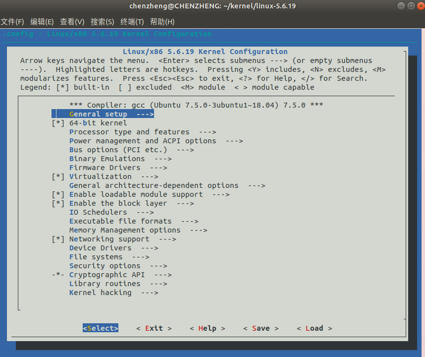
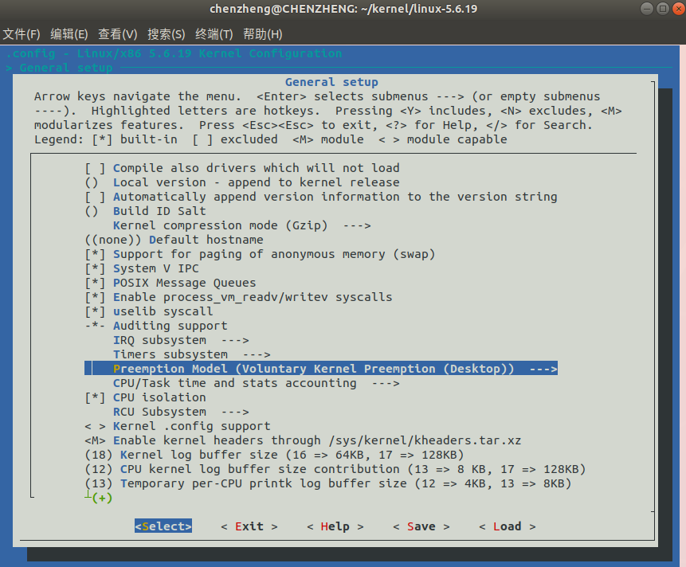
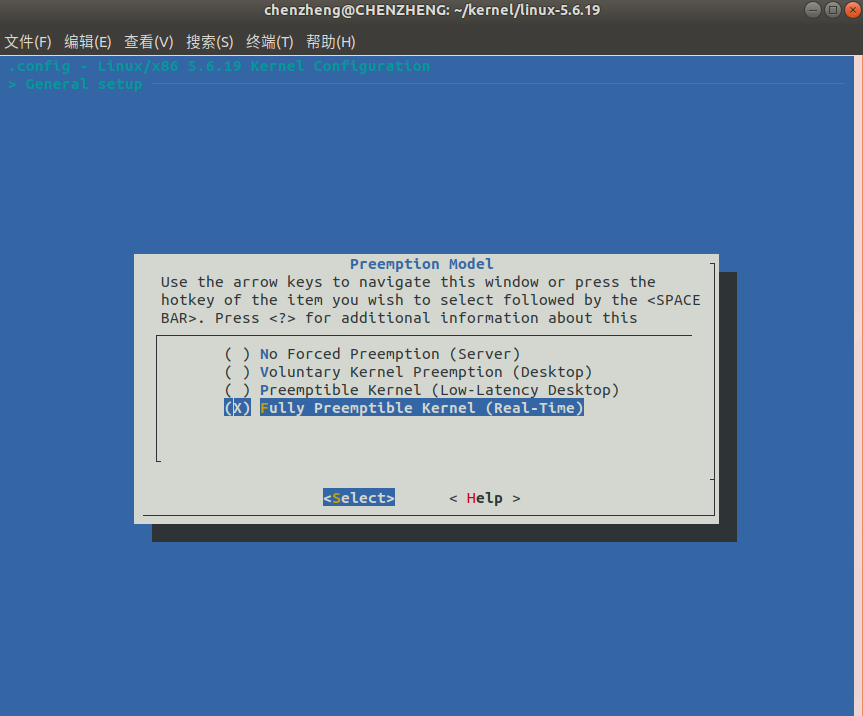
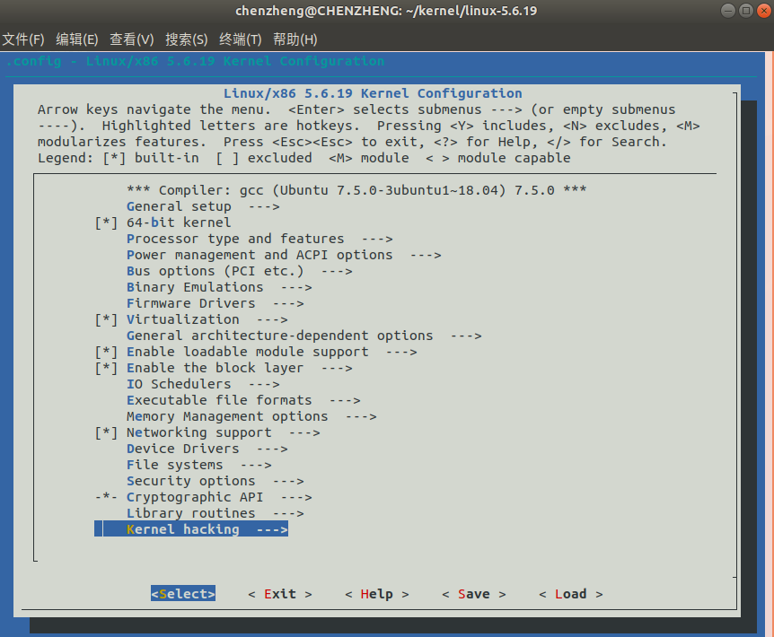
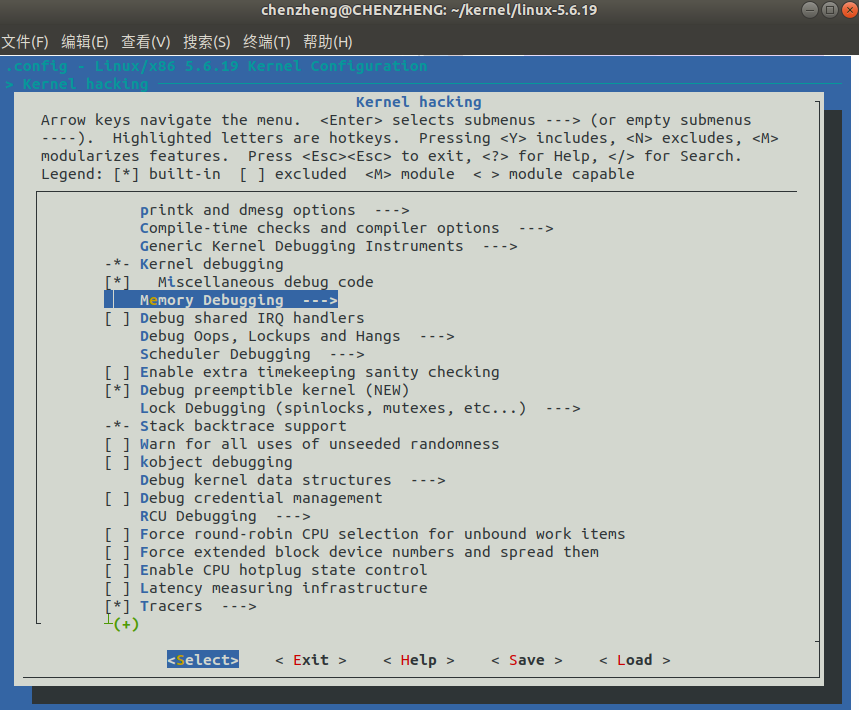
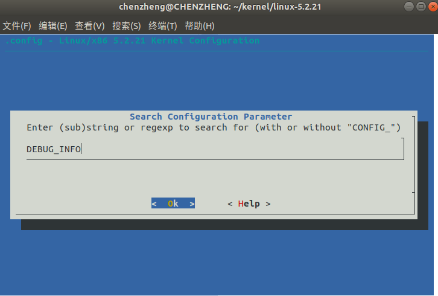
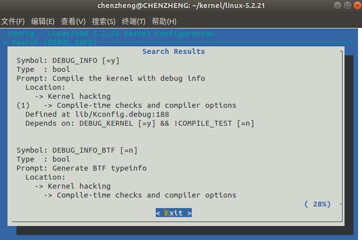

实时内核的编译
=================

`RT-Preempt <https://rt.wiki.kernel.org/index.php/Main_Page>`_
是在 Linux 社区 kernel 的基础上，加上相关的补丁，以使得 Linux 满足硬实时的需求。下面是编译配置流程，以内核 `5.6.19` 为例。

下载内核及 rt 补丁
-----------------------

1. 新建文件夹，用于存放内核及补丁

::

 mkdir ~/rt-kernel && cd ~/rt-kernel

tip
 使用外网访问，若无外网则使用手机热点访问。

2. 下载 `rt 补丁 <https://mirrors.edge.kernel.org/pub/linux/kernel/projects/rt/>`_

3. 下载 `内核源码 <https://mirrors.edge.kernel.org/pub/linux/kernel/v5.x/>`_

tip
 内核版本与补丁版本需要严格对应

4. 打补丁

::

 sudo apt-get install libncurses-dev #安装依赖项
 tar -xzvf linux-5.6.19.tar.gz #解压内核
 gunzip patch-5.6.19-rt12.patch.gz #解压补丁
 cd linux-5.6.19/
 patch -p1 < ../patch-5.6.19-rt12.patch #打补丁

本文使用的内核是`linux-5.6.19.tar.gz`，rt 补丁是`patch-5.6.19-rt12.patch.gz`。

配置内核
-----------------------

1. 打开内核配置界面

::

 make menuconfig

2. 选 General setup，如果内核版本老一点没有下一步中的选项的话选 Processor Type and features

3. 选 Preemption Model (Voluntary Kernel Preemption (Desktop))

4. 选 Fully Preemptible Kernel (RT)，然后一直按 esc 键返回至主页面

5. 选 Kernel hacking

6. 选 Memory Debugging

7. 取消选择 Check for stack overflows，本来就没有选择可以忽略

8. 按下‘/’搜索 DEBUG_INFO

9. 按下‘1’

10. 在 Compile the kernel with debug info 选项上按下‘n’，取消编译时产生 debug 文件

.. image:: ../images/digging_deeper/rt_kernel/rt_kernel_8.png

tip
 编译内核会产生一个极大的 debug 文件，实际安装时无需使用该文件，故可直接阻止其生成

内核编译
-----------------------

1. 编译并安装内核

::

    CONFIG_DEBUG_INFO=n #阻止编译产debug文件
    make -j`nproc` && make -j`nproc` bindeb-pkg #编译并打包

tip
 'nproc'为 CPU 线程数。

然后你将获得

::

    linux-firmware-image-5.6.19-rt12_5.6.19-rt12-1_amd64.deb
    linux-headers-5.6.19-rt12_5.6.19-rt12-1_amd64.deb
    linux-image-5.6.19-rt12_5.6.19-rt12-1_amd64.deb
    linux-libc-dev_5.6.19-rt12-1_amd64.deb

安装内核
-----------------------

tip
 此时可用 U 盘拷贝.deb 包至其他设备进行安装，且无需再次编译

进入软件包的文件夹并安装内核

::

 sudo dpkg -i linux-*.deb

2. 更新 grub 并重启

::

    sudo update-grub
    sudo reboot

3. 查看内核版本
::

 uname -a

此时可以看到内核版本中有` PREEMPT RT` 标识，可以进行 `实时性测试 <rt_test.md>`_

错误合集
-----------------------

1. 无法打开内核配置界面 menuconfig

Q1:（linux-4.17.2 内核为例）

::

   root@simon-virtual-machine:/home/simon/Src/linux-4.17.2# make menuconfig
   YACC scripts/kconfig/zconf.tab.c
   /bin/sh: 1: bison: not found
   scripts/Makefile.lib:196: recipe for target 'scripts/kconfig/zconf.tab.c' failed
   make[1]: *** [scripts/kconfig/zconf.tab.c] Error 127
   Makefile:528: recipe for target 'menuconfig' failed
   make: *** [menuconfig] Error 2

A1：
::

   apt-get install bison -y

Q2：
::

   root@simon-virtual-machine:/home/simon/Src/linux-4.17.2# make menuconfig
   YACC scripts/kconfig/zconf.tab.c
   LEX scripts/kconfig/zconf.lex.c
   /bin/sh: 1: flex: not found
   scripts/Makefile.lib:188: recipe for target 'scripts/kconfig/zconf.lex.c' failed
   make[1]: *** [scripts/kconfig/zconf.lex.c] Error 127
   Makefile:528: recipe for target

A2：
::

   sudo apt-get install flex

