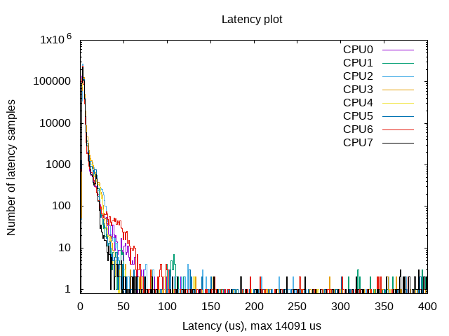
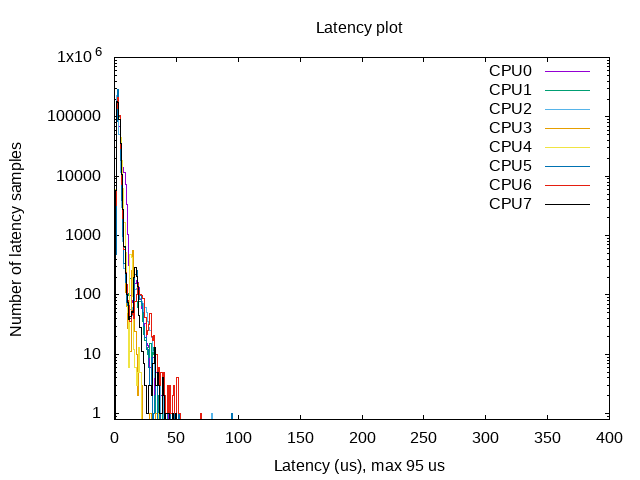

测试内核实时性
=================

安装测试脚本
-----------------------

测试脚本在 rm_bringup 中，点击
`此处 <https://github.com/rm-controls/rm_bringup>`_
将此仓库拉到本地即可。

安装脚本依赖
-----------------------
::

 sudo apt install rt-tests stress gnuplot

进行测试
-----------------------

进入脚本所在文件夹并运行实时性测试脚本
+++++++++++++++++++++++++++++++++++++++

::

    cd rm_bringup/scripts
    sudo sh ./rh-test.sh

等待测试完成,测试结果会生成图片放在测试脚本所在文件夹
+++++++++++++++++++++++++++++++++++++++++++++++++++++++++++++++++

以下图片为安装实时补丁前后的对比，可以明显看出安装补丁后实时性有了极大的提升。

分析：

1、左侧的更多样本通常意味着更低的延迟

2、更多的聚类样本表示更少的颤动

3、最大延迟不应偏离平均值太远（通常在 100us 以下）
