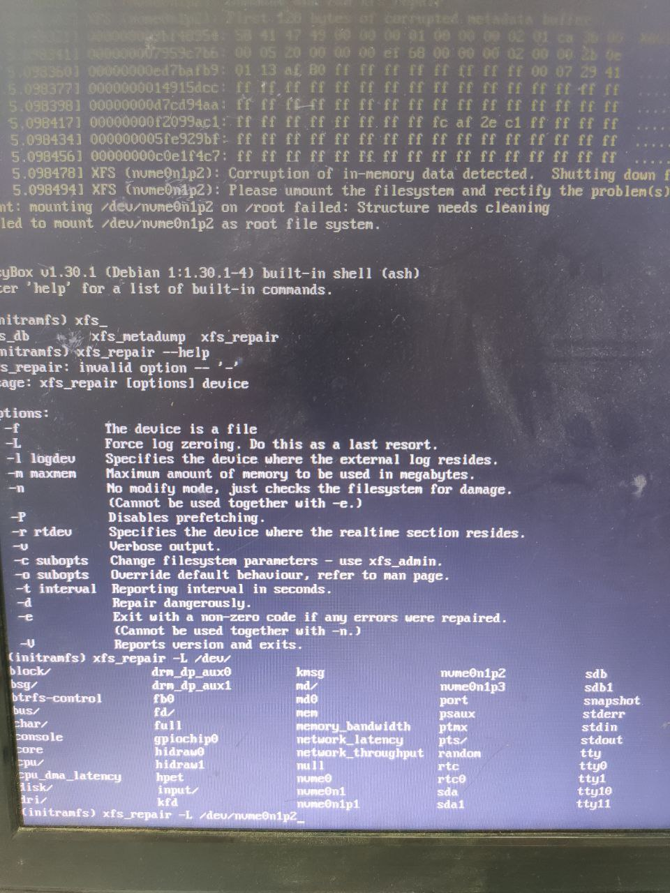

服务器修锅指南
===========

经过观测，服务器放在架子上时出锅率明显减小，不排除震动导致死机的可能。

安全重启的方式（深圳备赛版）
------------------

如果能够连接ssh通过ssh重启，如果不能则安装telnet ``sudo apt install telnet`` 在确定连接到服务器同一个网络中（目前为604 wifi）后 ``telnet 192.168.2.100 4094`` 如果成功连接会要求输入密码，输入密码后会进入SysRq命令行，注意这不是ssh，不要乱输入内容，然后逐个输入单字母 s u b，每输入一个字母都回车并等待至少五秒钟，在输入b并回车后等待五到十秒连接会自动断开，此时服务器已经重启，正常情况下等待约三分钟gitlab即可正常访问。

已经确定的固定修复流程
------------------

xfs文件系统启动时报错
>>>>>>>>>>>>>

表现：在一次强制关机后无论重启多少次都没有成功启动的迹象，没有可访问的服务，连接显示器后发现没有挂载根目录文件系统。
修复方式：执行``xfs_repair -L /dev/nvme0n1p2``后``ctrl+alt+del``重启

log文件占满硬盘
>>>>>>>>>>>>>>>>>>

表现：服务都能正常访问但非常缓慢，严重时出现刚开机时正常但很快就死机，ssh连接到服务器后使用``df -h``发现有一个分区被占满，通常是根目录或/mnt/hdd
修复方式：首先关闭所有服务``sudo systemctl stop docker``防止修复过程中死机（也可以选择在启动时修改启动选项进入单人维护模式），从根目录开始通过``du -h --max-depth=1``命令逐渐定位超大文件夹的位置，在之前的修复中遇到过``/mnt/hdd/gitlab/logs/puma``过大。
确定了超大文件夹之后考虑该文件夹是否包含有用的文件，小心删除大文件。
之前遇到的puma过大的情况，删除整个文件夹后首次启动gitlab会花费更长的时间。

未确定修复方式的问题
-----------------

gitlab
>>>>>>>>>>>>

绝大部分锅都是gitlab引发的，触发时间比较随机，也没有观察到和使用强度或CI状态有明显关系，通常的现象是gitlab服务无法访问但reprepro和gitlab-monitor都可以访问（monitor由于gitlab无法访问显示不出来内容），在服务器上硬盘灯和网口灯都会闪烁，但无论是插入显示器还是键盘鼠标都没有输出（甚至usb连供电都没有）。
如果在出锅前就已经插入了显示器和键盘，现象通常是显示器仅有左上角光标闪烁，键盘输入无反应。
通常在重启之后恢复正常
