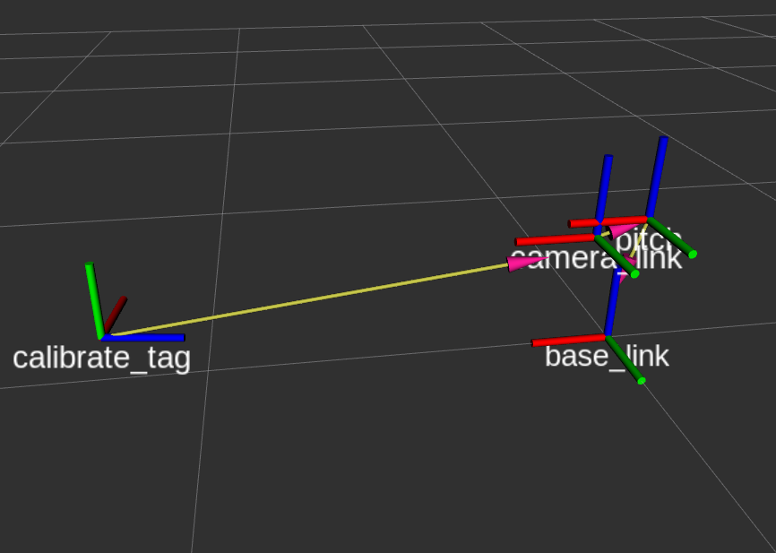
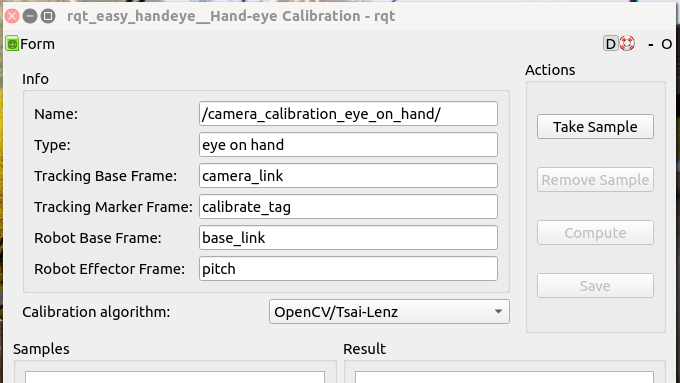

使用easy_handeye进行手眼标定
---------------------------------------------------------------------

1、在github上克隆easy_handeye的包到本地工作空间

`https://github.com/IFL-CAMP/easy_handeye`

2、安装依赖并编译
::

 rosdep install -yir --ignore-src --from-paths src

3、在easy_handeye包的launch文件夹下新建一个`my_calibration.launch`文件，内容如下：

::

    <launch>
        <arg name="namespace_prefix" default="camera_calibration"/>
        <arg name="eye_on_hand" default="true"/>
        <arg if="$(arg eye_on_hand)" name="namespace" value="$(arg namespace_prefix)_eye_on_hand" />
        <arg name="start_sampling_gui" value="true"/>
        <arg name="freehand_robot_movement" default="true" />
        <arg name="robot_base_frame" default="base_link"/>
        <arg name="robot_effector_frame" default="pitch"/>
        <arg name="tracking_base_frame" default="camera_link"/>
        <arg name="tracking_marker_frame" default="calibrate_tag"/>
        <arg name="move_group_namespace" default="/"/>
        <arg name="move_group" default="manipulator"/>

        <group ns="$(arg namespace)">
            <param name="eye_on_hand" value="$(arg eye_on_hand)"/>
            <param name="move_group_namespace" value="$(arg move_group_namespace)"/>
            <param name="move_group" value="$(arg move_group)"/>
            <param name="robot_base_frame" value="$(arg robot_base_frame)" />
            <param name="robot_effector_frame" value="$(arg robot_effector_frame)" />
            <param name="tracking_base_frame" value="$(arg tracking_base_frame)" />
            <param name="tracking_marker_frame" value="$(arg tracking_marker_frame)" />
            <param name="freehand_robot_movement" value="$(arg freehand_robot_movement)" />

            <node name="easy_handeye_calibration_server"
                  pkg="easy_handeye"
                  type="calibrate.py"
                  output="screen" />

            <node if="$(arg start_sampling_gui)" name="$(anon namespace)_rqt" pkg="rqt_easy_handeye" type="rqt_easy_handeye"
                  respawn="false" output="screen"/>
        </group>

        <!-- start rviz-->
        <node pkg="rviz" type="rviz" name="calibrate_rviz" output="screen"/>

    </launch>

其中`robot_effector_frame`可理解为相机安装的位置； `tracking_marker_frame`是apriltag标记的tf，可自定义。

注意

 my_calibration.launch 是在我们自己的电脑上运行的

4、新建一个启动apriltag的launch文件，内容如下：

::

    <launch>
        <arg name="launch_prefix" default=""/>
        <arg name="node_namespace" default="apriltag_ros_continuous_node"/>
        <arg name="camera_name" default="usb_cam"/>
        <arg name="camera_frame" default="camera_optical_frame"/>
        <arg name="image_topic" default="image_rect_color"/>

        <!-- start detection-->
        <include file="$(find apriltag_ros)/launch/continuous_detection.launch">
            <arg name="launch_prefix" value="$(arg launch_prefix)"/>
            <arg name="node_namespace" value="$(arg node_namespace)"/>
            <arg name="camera_name" value="$(arg camera_name)"/>
            <arg name="camera_frame" value="$(arg camera_frame)"/>
            <arg name="image_topic" value="$(arg image_topic)"/>
        </include>

        <rosparam command="load" file="$(find rm_bringup)/config/settings.yaml" ns="$(arg node_namespace)"/>
        <rosparam command="load" file="$(find rm_bringup)/config/tags.yaml" ns="$(arg node_namespace)"/>

    </launch>

还要在`config`文件夹里新建`settings.yaml`和`tags.yaml`用于设置apriltag标签的参数

settings.yaml：

::

    tag_family: 'tag36h11'
    tag_threads: 2
    tag_decimate: 1.0
    tag_blur:  0.0
    tag_refine_edges: 1
    tag_debug: 0
    max_hamming_dist: 2
    publish_tf: true

主要是设置apriltag的家族`tag_family`

tags.yaml：

::

    standalone_tags:
      [
      {id: 0, size: 0.1735, name: "calibrate_tag"},
      ]

主要是要设置`id`和`size`，`name`可自定义

5、在NUC上运行相机的驱动（也可以跑整套代码）和apriltag的launch

注意

 是在NUC运行

在`rviz`可以看到如下的`tf`：

打开`rqt`的`image_view`即可看到相机的图像以及apriltag

保持apriltag标签与机器人地盘的位置不变，移动云台在不同的方向看apriltag并且进行采样（点击下图软件中的`Take Sample`）

采集17个以上（可以多一点）的样本点，然后点击`Compute`，就会在`Result`中显示出结果，**需要将结果中的四元数转化为欧拉角**。

