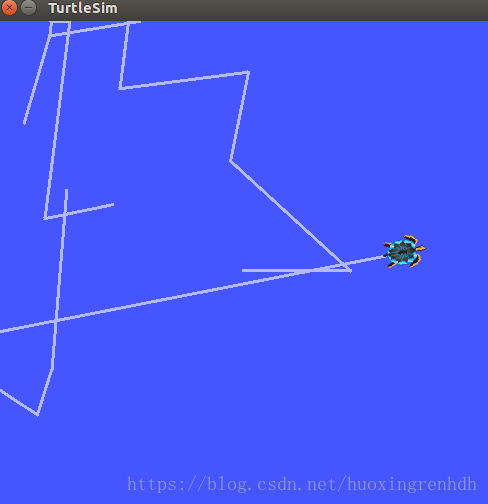

安装 ubuntu 系统
==================================

默认安装Ubuntu20.04，可参考 `Ubuntu18.04/20.04完整新手安装教程 <https://www.jianshu.com/p/54d9a3a695cc>`_ 安装ubuntu (链接失效)

安装ROS
==================================

默认安装ROS noetic，可参考ROS Wiki的 `安装教程 <http://wiki.ros.org/cn>`_ 安装ROS

想要知道ROS是否安装成功，可以运行 `小海龟测试程序 <https://blog.csdn.net/huoxingrenhdh/article/details/83381200>`_

如果出现下图，则表示安装成功。

