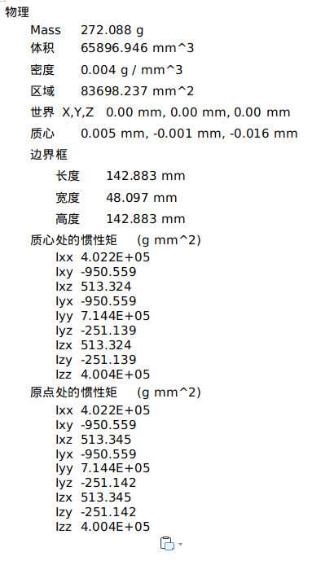

控制组 urdf 检查规范
============================

编写 urdf 代码以及获取参数
----------------------------------------------

确定好每一个 link ，并与机械组约定各个 link 的原点位置，然后要求机械组成员出一份关于每一个 link 的物理参数表文档和对应的 stl 文件。

其中 x 轴的朝向需要与车头的朝向一致，惯性矩需要取位于质心处的惯性矩。机械组成员给出的 stl 文件大小应不超过 2M 。

参数表格式如下：

使用 check_urdf 检查
----------------------------------------------

在编写完 urdf 代码后，先使用 check_urdf 来检查是否出现报错。

检查坐标系
----------------------------------------------

打开 gazebo ，勾选 **Edit | Reset World Pose** 将机器人还原为初始位置以及状态，然后再勾选 **View | Trasnparent** 将机器人的模型透明化，

完成后勾选 **View | Link Frames** 检查坐标系朝向是否正确。

检查惯性矩
----------------------------------------------

在 gazebo 中勾选 **View | inertia** 查看惯性矩是否正确，检查前要确保质心位置是否准确以及质量大小是否准确，检查标准：

+ 粉色立方体是否将模型基本包裹住
+ 假如质心不在模型的几何中心，那么粉色立方体应该偏向质心位置。

检查碰撞箱
----------------------------------------------

勾选  **View | collision**  检查碰撞箱是否基本将模型包裹住。
